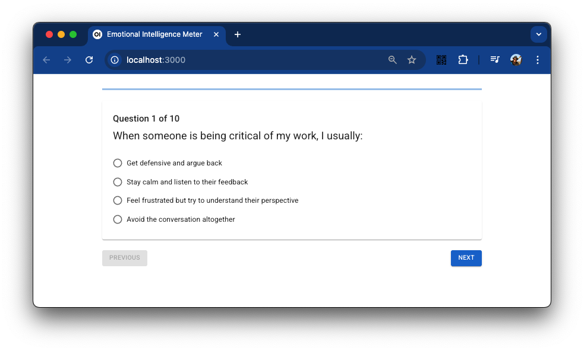
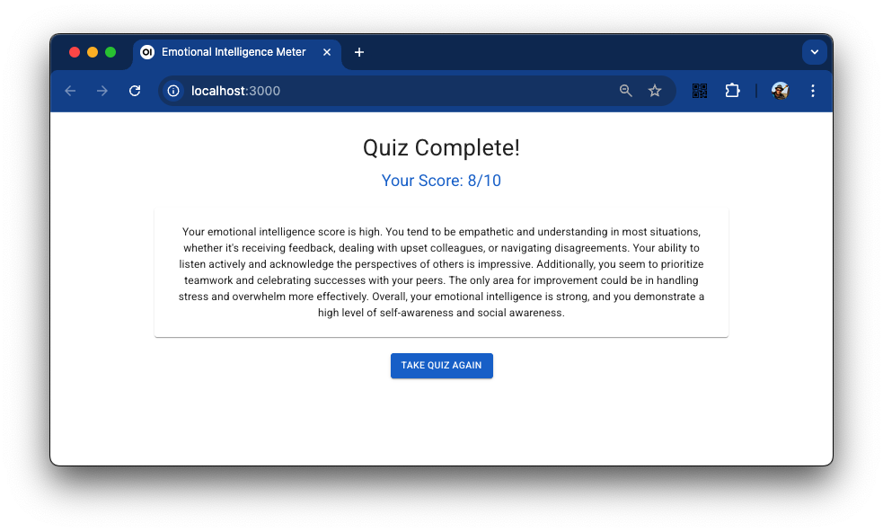

# Emotional Intelligence Meter

A full-stack application for measuring emotional intelligence through an interactive quiz. The application uses React for the frontend and FastAPI for the backend, with Ollama-based LLM integration for question generation and evaluation.

## Features

- Interactive quiz interface with 10 random questions
- Objective questions with 4 options each
- Dynamic question generation using LLM
- Emotional intelligence scoring (out of 10)
- Detailed feedback and analysis

## Project Structure

```
emotional-intelligence-meter/
├── backend/                 # FastAPI backend
│   ├── app/
│   │   ├── main.py
│   │   └── services/
│   │       └── llm_service.py
│   └── requirements.txt
└── frontend/               # React frontend
    ├── public/
    │   └── index.html
    ├── src/
    │   └── App.js
    │   └── index.js
    └── package.json
```

## Setup Instructions

### Backend Setup

1. Navigate to the backend directory
2. Create a virtual environment: `python -m venv .venv`
3. Activate the virtual environment:
   - Windows: `venv\Scripts\activate`
   - Unix/MacOS: `source .venv/bin/activate`
4. Install dependencies: `pip install -r requirements.txt`
5. Set environment variable to point Ollama instance, the default is: `OLLAMA_HOST=http://localhost:11434`
6. Run the server: `uvicorn app.main:app --reload`

### Frontend Setup

1. Navigate to the frontend directory
2. Install dependencies: `npm install`
3. Start the development server: `npm start`

### Screenshots




## Technologies Used

- Frontend: React, Material-UI
- Backend: FastAPI, Python
- LLM: llama3 hosted on Ollama


## API Endpoints

- `GET /api/health`: Basic health check of the API server
- `GET /api/questions`: Get 10 random questions
- `POST /api/submit`: Submit quiz answers and get evaluation

